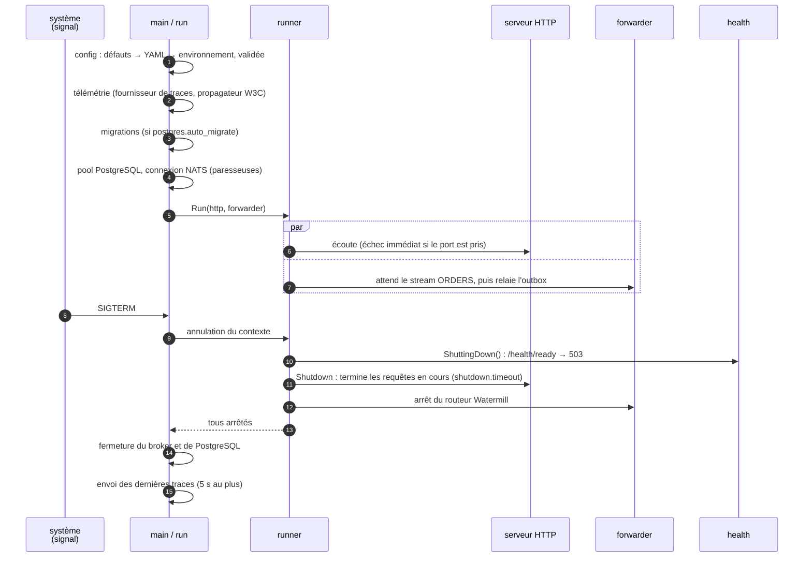

# Démarrage et arrêt

```mermaid
sequenceDiagram
    autonumber
    participant OS as système<br/>(signal)
    participant Main as main / run
    participant R as runner
    participant HTTP as serveur HTTP
    participant F as forwarder
    participant H as health

    Main->>Main: config : défauts → YAML → environnement, validée
    Main->>Main: télémétrie (fournisseur de traces, propagateur W3C)
    Main->>Main: migrations (si postgres.auto_migrate)
    Main->>Main: pool PostgreSQL, connexion NATS (paresseuses)
    Main->>R: Run(http, forwarder)
    par
        R->>HTTP: écoute (échec immédiat si le port est pris)
    and
        R->>F: attend le stream ORDERS, puis relaie l'outbox
    end

    OS->>Main: SIGTERM
    Main->>R: annulation du contexte
    R->>H: ShuttingDown() : /health/ready → 503
    R->>HTTP: Shutdown : termine les requêtes en cours (shutdown.timeout)
    R->>F: arrêt du routeur Watermill
    R-->>Main: tous arrêtés
    Main->>Main: fermeture du broker et de PostgreSQL
    Main->>Main: envoi des dernières traces (5 s au plus)
```

Si un composant échoue (port déjà pris, par exemple), le runner arrête les
autres, et le binaire se termine avec l'erreur : l'orchestrateur le
redémarre.
